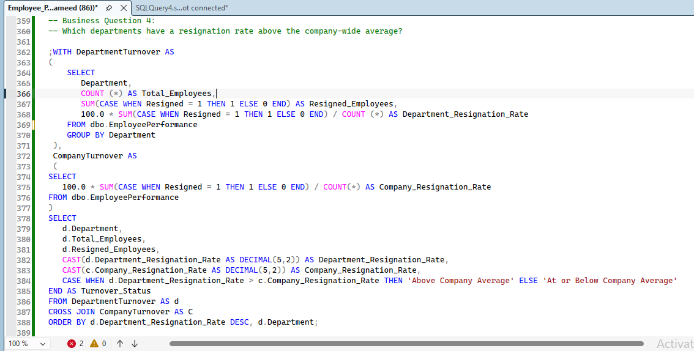
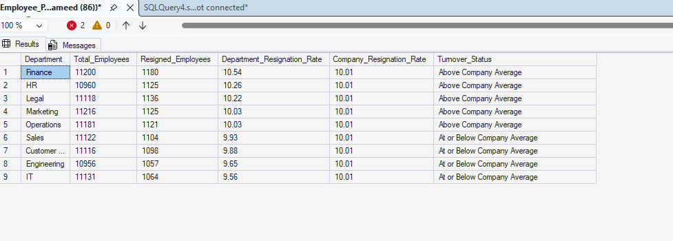
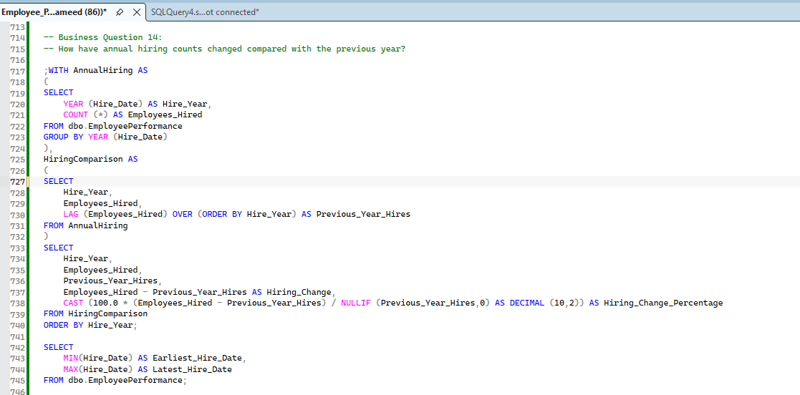
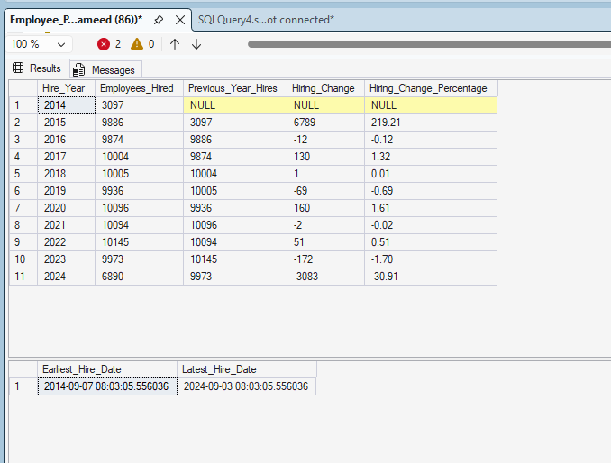

# Employee Performance Analysis Using SQL

## Project Overview

This project analyzes 100,000 employee records to identify workforce, performance, compensation, resignation, workload, remote-work, and hiring trends.

The analysis was completed in Microsoft SQL Server using data cleaning, validation, aggregation, common table expressions (CTEs), window functions, ranking functions, and business-focused SQL queries.

## Project Objectives

The project answers 15 business questions:

1. How is the workforce distributed across departments?
2. Which departments have the highest average performance?
3. Who are the top-performing employees in each department?
4. Which departments have resignation rates above the company average?
5. How does resignation vary by employee satisfaction level?
6. Which employees have the largest salary shortfalls compared with their job-title average?
7. How are training hours associated with performance and promotion rates?
8. Which employees may require further workload review?
9. Do male and female employees in comparable roles have different average salaries?
10. Which employee-tenure groups have the highest resignation rates?
11. How does remote-work frequency relate to performance, satisfaction, and resignation?
12. Which departments account for the largest share of monthly salary costs?
13. How does median salary compare with average salary for each job title?
14. How have annual hiring counts changed compared with the previous year?
15. Within each department, how do resignation rates differ between high performers and other employees?

## Dataset

The project uses a synthetic employee performance and productivity dataset containing:

* 100,000 employee records
* 9 departments
* Employee demographics
* Job titles and salaries
* Performance and satisfaction scores
* Training hours and promotions
* Overtime and sick days
* Remote-work frequency
* Hire dates and company tenure
* Resignation status

The original dataset is available on Kaggle:  
[Employee Performance and Productivity Data](https://www.kaggle.com/datasets/mexwell/employee-performance-and-productivity-data)

## Tools Used

* Microsoft SQL Server
* SQL Server Management Studio (SSMS)
* GitHub

## SQL Skills Demonstrated

* Database and table creation
* Data type conversion
* Data validation
* Primary key and check constraints
* Aggregate functions
* `CASE` expressions
* Common table expressions
* Window functions
* `ROW_NUMBER`
* `LAG`
* `PERCENTILE_CONT`
* Conditional aggregation
* Running totals
* Percentage calculations
* Department and job-title comparisons
* Business-focused result interpretation

## Data Preparation

The SQL script:

1. Creates the `EmployeePerformanceDB` database when it does not already exist.
2. Creates a staging table for the imported source data.
3. Checks the source structure and row counts.
4. Validates employee IDs, dates, salaries, scores, and resignation values.
5. Creates the final typed table with data-quality constraints.
6. Converts text values into appropriate SQL data types.
7. Confirms that 100,000 records were loaded successfully.
8. Performs 15 business analyses.

## Key Business Findings

* The workforce is distributed fairly evenly across departments. Marketing is the largest department, representing approximately 11.22% of employees.
* Engineering recorded the highest average performance score at 3.02, although differences between departments were small.
* The company-wide resignation rate was approximately 10.01%.
* Finance had the highest department resignation rate at 10.54%, followed by HR at 10.26% and Legal at 10.22%.
* Resignation rates were very similar across satisfaction groups, ranging from 9.90% to 10.06%.
* The largest observed salary shortfall was $1,199.32 for Engineers earning $6,600 compared with their job-title average of $7,799.32.
* Training-hour groups had nearly identical average performance and promotion rates.
* Remote-work groups also had similar performance, satisfaction, and resignation results.
* Department salary costs were balanced, with each department contributing approximately 11% of total monthly salary costs.
* Average and median salaries were close across job titles, suggesting that extreme salaries did not heavily distort job-title averages.
* Full-year hiring counts remained relatively stable from 2015 through 2023.
* High performers did not consistently resign more or less often than other employees across departments.
## Featured SQL Analysis

### Department Resignation Rates Compared with the Company Average

The analysis calculates each department’s resignation rate, compares it with the company-wide rate, and classifies each department as above or at/below the company average.

#### SQL Query

#### Query Results

### Annual Hiring Trend

This analysis uses the `LAG()` window function to compare each year’s employee count with the previous year and calculate the numerical and percentage change.

The results show relatively stable full-year hiring between 2015 and 2023. The large changes in 2015 and 2024 should not be treated as normal year-over-year trends because 2014 and 2024 contain only partial-year records.

#### SQL Query

#### Query Results

## Important Interpretation Notes

The results are descriptive and show patterns within this dataset. They do not prove that one employee characteristic causes another outcome.

Salary differences should be reviewed alongside experience, tenure, responsibilities, location, and performance. Similarly, workload indicators identify employees for further review but do not prove employee burnout.

The dataset includes employees marked as resigned, so workforce counts and salary totals should not be interpreted as the company’s current active headcount or payroll.

## Project File

* [View the complete SQL analysis](./Employee_Performance_Analysis.sql)

## How to Run the Project

1. Download the [Employee Performance and Productivity Data](https://www.kaggle.com/datasets/mexwell/employee-performance-and-productivity-data) from Kaggle.

2. Open SQL Server Management Studio.

3. Import the source data as:

   `dbo.Extended_Employee_Performance_and_Productivity_Data`

4. Open `Employee_Performance_Analysis.sql`.

5. Execute the setup and data-cleaning sections once.

6. Run the business-question queries to review the results.

> The setup section creates permanent tables and is intended to be executed once. Rerunning the entire script without removing the existing tables may produce “object already exists” or duplicate-key errors.

## Author

**Mohammed Masood Ali**

MBA – Data Analytics
Aspiring Data Analyst
